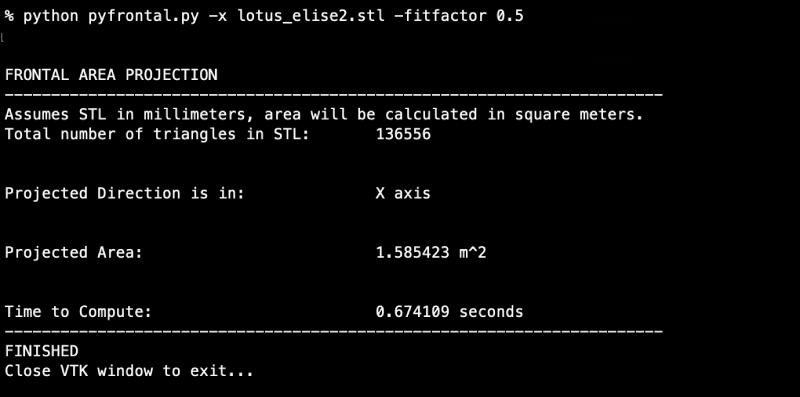
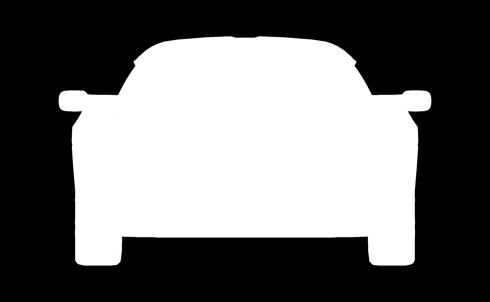

## pyfrontal.py

This is a self-contained python script that can be used to compute frontal area
projections of STL meshes for use in analysis, particularly when doing 
comparisons of frontal area of automotive shapes for CFD purposes. 

External Dependencies: 

- VTK 
- Numpy

There is a formal python package named Parea 
(https://github.com/nathanrooy/p-area) that takes an analytical approach to this 
problem by calculating the area of all of the triangles of a mesh in the chosen 
axis, however this program was very, very slow for me when attempting 
computations on very large STL files which is common when dealing with meshes 
straight from 3D scanning, say, of wind tunnel models. 
'parea' could not handle computing meshes that were GB's in size without locking 
up a machine. 
The method I am using leverages the VTK rendering pipeline to take a numerical 
approach to the area calculation problem, using ray-tracing on a fixed raster 
resolution window to compute an approximation of the projected orthogonal area.

This method is ~30x-60x faster than the analytical approach and is inspired by
the  method that is used to measure frontal area of physical vehicles for 
windtunnel testing, which uses collimated laser light sources and photo mapping 
to measure the shadow of a vehicle in a darkroom.  

Because the heavy lifting is being done by VTK, a compiled package that is 
meant to load and view very large data and visualizations, this script can 
handle medium sized exterior vehicle STL's in <1 second and can handle even very
large scans, 1GB+ files in about 30 seconds on an M1 Macbook.  
Binary STLs load fine and the VTK render doesn't care about unified
normals, non-manifolds, etc.  It tends to just work.

The accuracy for typical sedan sized test vehicles seems to be roughly ~0.0015 m^2
or better depending on the resolution used and the fit factor of vehicle to
render frame.  

The program has several command line options (see -h for help) to help get best
results.  It generates a PNG of the computed shadowmask by default and shows it
in a preview, but this can be disabled via -nosave and -noshow. Default is 
projection in the X direction as is the case for most frontal areas of 
automotive models and default windowing and resolution is roughly correct for 
most vehicles. 

The scale and resolution are adaptable, but the defaults are mostly setup to work with car-
sized STL models in millimeters.  The program has some safety checks to 
determine if the renderer is configured to work with an appropriate model size,
and if not, it exits with error info. 

To test, run:
python pyfrontal.py -x tests/test_mesh.stl

This should result in a Projected Area: 2.0 m^2 

An example use case: 

The resulting preview window:

